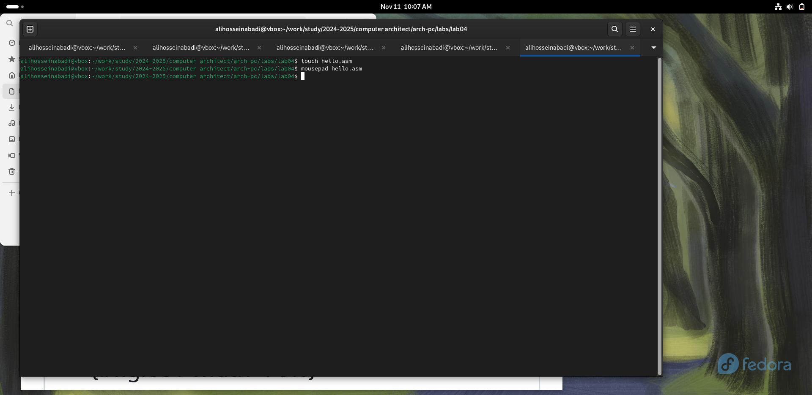
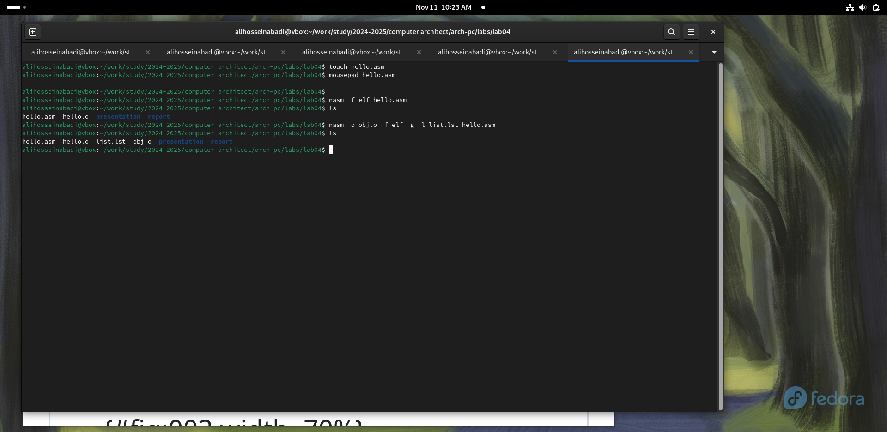
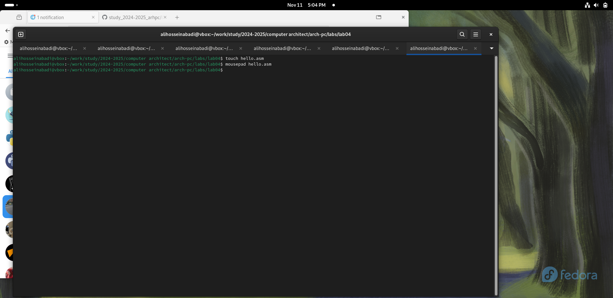
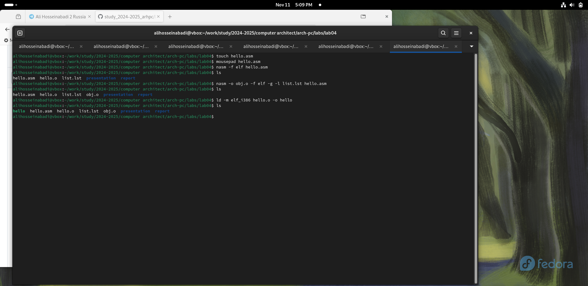
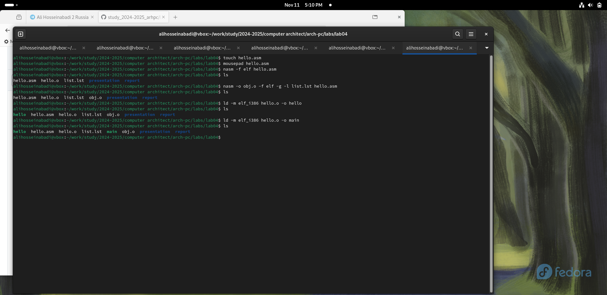
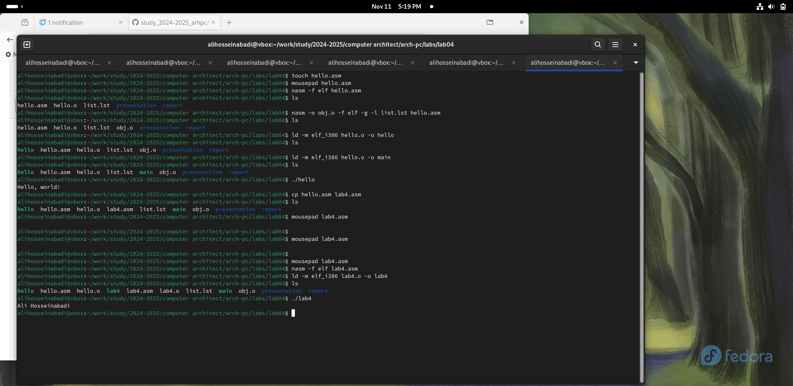

---
## Front matter
title: "Report on Laboratory Work No. 4"
subtitle: "Discipline: Computer Architecture"
author: "Ali Hosseinabadi"

## Generic options
lang: ru-RU
toc-title: "Table of Contents"

## Bibliography
bibliography: bib/cite.bib
csl: pandoc/csl/gost-r-7-0-5-2008-numeric.csl

## Pdf output format
toc: true # Table of contents
toc-depth: 2
lof: true # List of figures
lot: true # List of tables
fontsize: 12pt
linestretch: 1.5
papersize: a4
documentclass: scrreprt

## I18n polyglossia
polyglossia-lang:
  name: english
  options:
	- spelling=modern
	- babelshorthands=true
polyglossia-otherlangs:
  name: russian

## I18n babel
babel-lang: english
babel-otherlangs: russian

## Fonts
mainfont: IBM Plex Serif
romanfont: IBM Plex Serif
sansfont: IBM Plex Sans
monofont: IBM Plex Mono
mathfont: STIX Two Math
mainfontoptions: Ligatures=Common,Ligatures=TeX,Scale=0.94
romanfontoptions: Ligatures=Common,Ligatures=TeX,Scale=0.94
sansfontoptions: Ligatures=Common,Ligatures=TeX,Scale=MatchLowercase,Scale=0.94
monofontoptions: Scale=MatchLowercase,Scale=0.94,FakeStretch=0.9
mathfontoptions:

## Biblatex
biblatex: true
biblio-style: "gost-numeric"
biblatexoptions:
  - parentracker=true
  - backend=biber
  - hyperref=auto
  - language=auto
  - autolang=other*
  - citestyle=gost-numeric

## Pandoc-crossref LaTeX customization
figureTitle: "Fig."
tableTitle: "Table"
listingTitle: "Listing"
lofTitle: "List of Illustrations"
lotTitle: "List of Tables"
lolTitle: "Listings"

## Misc options
indent: true
header-includes:
  - \usepackage{indentfirst}
  - \usepackage{float} # keep figures where they are in the text
  - \floatplacement{figure}{H} # keep figures where they are in the text
---

# Objective of the Work

The objective of this laboratory work is to master the procedures for compiling and building programs written in NASM assembly language.

# Assignment

1. Create a Hello World program!
2. Work with the NASM translator.
3. Work with the extended syntax of the NASM command line.
4. Work with the LD linker.
5. Run the executable file.
6. Complete independent work assignments.

# Theoretical Introduction

The primary functional elements of any computer are the central processor, memory, and peripheral devices.

The interaction of these devices occurs through a shared bus to which they are connected. Physically, the bus consists of a large number of conductors that connect devices to each other. In modern computers, these conductors are made in the form of conductive tracks on the motherboard.

The main task of the processor is to process information and organize the coordination of all computer nodes. The central processor includes the following units:

- Arithmetic Logic Unit (ALU) — performs logical and arithmetic operations necessary to process information stored in memory;
- Control Unit (CU) — provides control and checks all devices of the computer;
- Registers — ultra-fast temporary storage within the processor for storing intermediate results of instructions; processor registers are divided into two types: general-purpose registers and special registers.

To write programs in assembly language, it is necessary to know what processor registers exist and how they can be used. Most commands in assembly programs use registers as operands. Practically all commands represent transformations of data stored in processor registers, such as moving data between registers or between registers and memory, and performing mathematical or logical operations on data stored in registers.

Access to registers is done by names, rather than by addresses like with main memory. Each register in the x86 architecture has a name consisting of 2 or 3 Latin letters.

For example, here are the names of the main general-purpose registers (these registers are most frequently used in programming):

- RAX, RCX, RDX, RBX, RSI, RDI — 64-bit
- EAX, ECX, EDX, EBX, ESI, EDI — 32-bit
- AX, CX, DX, BX, SI, DI — 16-bit
- AH, AL, CH, CL, DH, DL, BH, BL — 8-bit 

Another important node of a computer is Random Access Memory (RAM). RAM is a fast volatile memory that directly interacts with processor nodes, intended for storing programs and data with which the processor works at the current moment. RAM consists of uniform numbered memory cells. The number of a memory cell is the address of the data stored in it.

The peripheral devices of a computer include:

- External memory devices intended for long-term storage of large volumes of data.
- Input-output devices that ensure interaction between the CPU and the external environment. 

The computational process of a computer is based on the principle of program control. This means that a computer solves a given task as a sequence of actions recorded in the form of a program.

Instruction codes represent multi-digit binary combinations of 0s and 1s. In the machine instruction code, two parts can be distinguished: operational and address. The operational part stores the code of the command that needs to be executed. The address part contains the data or addresses of the data involved in performing the operation.

When executing each command, the processor carries out a certain standard sequence of actions known as the processor's command cycle. This involves:

1. Forming the address in memory of the next command;
2. Reading the command code from memory and its decoding;
3. Executing the command;
4. Transitioning to the next command.

Assembly language (abbreviated as asm) is a low-level machine-oriented language.

NASM is an open assembler project with versions available for different operating systems, which enables the generation of object files for these systems. NASM uses Intel syntax and supports x86-64 instructions.

# Conducting Laboratory Work

## Hello World Program

I create a file hello.asm in which I will write a program in assembly language. (Fig. -@fig:002)

{#fig:001 width=70%}

Using the editor, I write the program in the created file. (Fig. -@fig:002)

{#fig:002 width=70%}

## NASM Translator

I compile my program using NASM. (Fig. -@fig:003)

{#fig:003 width=70%}

## Extended NASM Command Line Syntax

I execute the command shown in (Fig. -@fig:004), which compiles the source file hello.asm into obj.o; the .o extension indicates that the file is an object file. Additionally, the flags -g and -l prepare the debugging file and listing, respectively.

{#fig:004 width=70%}

## LD Linker

Then I need to transfer the object file to the linker, which I do using the ld command. (Fig. -@fig:005)

{#fig:005 width=70%}

Next, I execute the following command ..., the result of this command will be a created file main, compiled from the object file obj.o. (Fig. -@fig:006)

{#fig:006 width=70%}

## Running the Executable File 

I run the executable file from the current directory. (Fig. -@fig:007)

{#fig:007 width=70%}

## Independent Work Assignments

I create a copy of the file for subsequent work. (Fig. -@fig:008)

{#fig:008 width=70%}

I edit the copy of the file, replacing the text with my first and last name. (Fig. -@fig:09)

I translate the copy of the file into an object file, link it, and run it. (Fig. -@fig:09)

{#fig:09 width=70%}

Having ensured the program works correctly, I copy the working files into my local repository. (Fig. -@fig:010)

{#fig:010 width=70%}

Uploading changes to my remote repository on GitHub.

# Conclusions

In carrying out this laboratory work, I learned the procedures for compiling and building programs written in the NASM assembly language.

# References

1. [Example of laboratory work execution](https://github.com/evdvorkina/study_2022-2023_arh-pc/blob/master/labs/lab05/report/%D0%9B05_%D0%94%D0%B2%D0%BE%D1%80%D0%BA%D0%B8%D0%BD%D0%B0_%D0%BE%D1%82%D1%87%D0%B5%D1%82.md?plain=1)

2. [Course at RUDN University](https://esystem.rudn.ru/course/view.php?id=112)

3. [Laboratory Work No. 4](https://esystem.rudn.ru/pluginfile.php/2089084/mod_resource/content/0/%D0%9B%D0%B0%D0%B1%D0%BE%D1%82%D0%BE%D1%80%D0%BD%D0%B0%D1%8F%20%D1%80%D0%B0%D0%B1%D0%BE%D1%82%D0%B0%20%E2%84%964.%20%D0%A1%D0%BE%D0%B7%D0%B4%D0%B0%D0%BD%D0%B8%D0%B5%20%D0%B8%20%D0%BF%D1%80%D0%BE%D1%86%D0%B5%D1%81%20%D0%BE%D0%B1%D1%80%D0%B0%D0%B1%D0%BE%D1%82%D0%BA%D0%B8%20%D0%BF%D1%80%D0%BE%D0%B3%D1%80%D0%B0%D0%BC%D0%BC%20%D0%BD%D0%B0%20%D1%8F%D0%B7%D1%8B%D0%BA%D0%B5%20%D0%B0%D1%81%D1%81%D0%B5%D0%BC%D0%B1%D0%BB%D0%B5%D1%80%D0%B0%20NASM.pdf)

4. [Programming in NASM Assembly Language by A.V. Stolyarov](https://esystem.rudn.ru/pluginfile.php/2088953/mod_resource/content/2/%D0%A1%D1%82%D0%BE%D0%BB%D1%8F%D1%80%D0%BE%D0%B2%20%D0%90.%20%D0%92.%20-%20%D0%9F%D1%80%D0%BE%D0%B3%D1%80%B0%D0%BC%D0%BC%D0%B8%D1%80%D0%BE%D0%B2%D0%B0%D0%BD%D0%B8%D0%B5%20%D0%BD%D0%B0%20%D1%8F%D0%B7%D1%8B%D0%BA%D0%B5%20%D0%B0%D1%81%D1%81%D0%B5%D0%BC%D0%B1%D0%BB%D0%B5%D1%80%D0%B0%20NASM%20%D0%B4%D0%BB%D1%8F%20%D0%9E%D0%A1%20Unix.pdf)