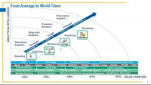
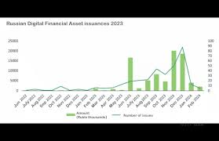
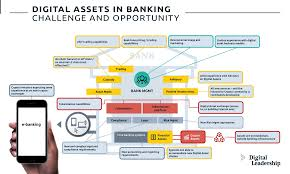

# Презентация: Экономика единиц для Цифровых Финансовых Активов (DFA)

---

## Слайд 1: Заглавный слайд
Экономика единиц для Цифровых Финансовых Активов (DFA)  
Дорожная карта для инвесторов  

---

## Слайд 2: Введение
Что такое цифровые финансовые активы (DFA)?  
DFA представляют собой активы, существующие в цифровом формате, такие как криптовалюты, токены и другие формы цифровых инвестиций, которые быстро развиваются на финансовом рынке.  

---

## Слайд 3: Экономика единиц
Определение экономики единиц:  
Экономика единиц фокусируется на расчетах, используемых для оценки прибыльности и стоимости бизнес-моделей. Ключевые показатели включают:  
- ARPU (Доход на пользователя) — средний доход от одного пользователя.  
- CAC (Затраты на привлечение клиента) — сумма средств, необходимых для привлечения нового клиента.  
- LTV (Пожизненная ценность клиента) — общая сумма доходов, которую клиент приносит за все время взаимодействия с бизнесом.  

---

## Слайд 4: Важность экономики единиц
Значение для инвесторов:  
Экономика единиц помогает инвесторам:  
- Анализировать риски и возможности — понимание динамики дохода и затрат позволяет сделать более информированный выбор.  
- Прогнозировать будущие доходы — на основе исторических данных можно прогнозировать доходность.  
- Оценивать эффективность инвестиционных стратегий — понимание своих затрат и доходностей поможет оптимизировать вложения.  

---

## Слайд 5: Ключевые показатели
Основные метрики DFA:  
Важные для анализа DFA показатели включают:  
- Общий объем торгов — показывает ликвидность актива.  
- Рыночная капитализация — общая стоимость всех токенов на рынке.  
- Волатильность — измеряет колебания цены актива.  

---

## Слайд 6: Успешные модели DFA
Примеры успешных проектов:  
Некоторые проекты DFA используют успешные модели экономики единиц для достижения роста и устойчивости. Эти модели помогают определять стратегии, направленные на привлечение и удержание клиентов.  

---

## Слайд 7: Оценка рисков
Риски при инвестициях в DFA:  
Инвестирование в DFA связано с рисками, такими как:  
- Высокая волатильность — внезапные изменения цен могут повлиять на прибыль.  
- Регуляторные риски — законы о цифровых финансах могут варьироваться в разных юрисдикциях.  

---

## Слайд 8: Стратегии для инвестиций
Рекомендации для инвесторов:  
Чтобы эффективно инвестировать в DFA, рекомендуется:  
- Диверсифицировать портфель — не вкладывайте все средства в один актив.  
- Сосредоточиться на долгосрочных инвестициях — избегайте спекулятивной торговли ради большей стабильности.  

---

## Слайд 9: Заключение
Выводы:  
Экономика единиц является важным инструментом для оценки DFA и принятия обоснованных инвестиционных решений. Она помогает инвесторам четко увидеть потенциальные риски и доходности.  

---

## Слайд 10: Вопросы и ответы
Овремя для вопросов:  
Приглашаем задавать вопросы!  

---