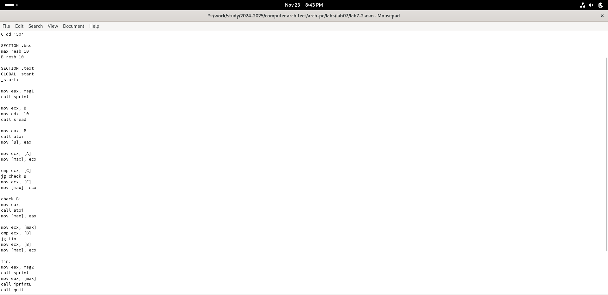

---
## Front Matter
title: "Report on Laboratory Work No. 7"
subtitle: "Discipline: Computer Architecture"
author: "ali hosseiabadi"

## Generic Options
lang: en-US
toc-title: "Table of Contents"

## Bibliography
bibliography: bib/cite.bib
csl: pandoc/csl/gost-r-7-0-5-2008-numeric.csl

## Pdf Output Format
toc: true # Table of contents
toc-depth: 2
lof: true # List of figures
lot: true # List of tables
fontsize: 12pt
linestretch: 1.5
papersize: a4
documentclass: scrreprt
## I18n Polyglossia
polyglossia-lang:
  name: russian
  options:
	- spelling=modern
	- babelshorthands=true
polyglossia-otherlangs:
  name: english
## I18n Babel
babel-lang: russian
babel-otherlangs: english
## Fonts
mainfont: IBM Plex Serif
romanfont: IBM Plex Serif
sansfont: IBM Plex Sans
monofont: IBM Plex Mono
mathfont: STIX Two Math
mainfontoptions: Ligatures=Common,Ligatures=TeX,Scale=0.94
romanfontoptions: Ligatures=Common,Ligatures=TeX,Scale=0.94
sansfontoptions: Ligatures=Common,Ligatures=TeX,Scale=MatchLowercase,Scale=0.94
monofontoptions: Scale=MatchLowercase,Scale=0.94,FakeStretch=0.9
mathfontoptions:
## Biblatex
biblatex: true
biblio-style: "gost-numeric"
biblatexoptions:
  - parentracker=true
  - backend=biber
  - hyperref=auto
  - language=auto
  - autolang=other*
  - citestyle=gost-numeric
## Pandoc-Crossref LaTeX Customization
figureTitle: "Fig."
tableTitle: "Table"
listingTitle: "Listing"
lofTitle: "List of Figures"
lotTitle: "List of Tables"
lolTitle: "Listings"
## Misc Options
indent: true
header-includes:
  - \usepackage{indentfirst}
  - \usepackage{float} # Keep figures where they are in the text
  - \floatplacement{figure}{H} # Keep figures where they are in the text
---

# Purpose of the Work

Study of conditional and unconditional jump instructions. Acquiring skills in writing programs using jumps. Introduction to the purpose and structure of a listing file.

# Assignment

1. Implement jumps in NASM
2. Study the structure of listing files
3. Independently write programs based on the materials of the laboratory work

# Theoretical Introduction

To implement branching in assembly language, the so-called control transfer instructions or jump instructions are used. There are two types of jumps:
* Conditional jump – the execution or non-execution of a jump to a specific point in the program depending on the condition check.
* Unconditional jump – the execution of a control transfer to a specific point in the program without any conditions.

# Laboratory Work Execution

## Implementing Jumps in NASM

Create a directory for the laboratory work programs No. 7 (Fig. -@fig:001).

{#fig:001 width=70%}

Copy the code from the listing into the file of the future program. (Fig. -@fig:002).

{#fig:002 width=70%}

Upon running the program, I confirmed that the unconditional jump indeed changes the order of instruction execution (Fig. -@fig:003).

{#fig:003 width=70%}

I modified the program so that the order of function execution changes (Fig. -@fig:004).

{#fig:004 width=70%}

Run the program and check that the applied changes are correct (Fig. -@fig:005).

{#fig:005 width=70%}

Now, I modify the program text so that all three messages are displayed in reverse order (Fig. -@fig:006).

{#fig:006 width=70%}

The work was completed correctly, the program displays the messages in the order I wanted (Fig. -@fig:007).

{#fig:007 width=70%}

Create a new working file and insert the code from the next listing (Fig. -@fig:008).

{#fig:008 width=70%}

The program displays the value of the variable with the maximum value. I check the program with different input data (Fig. -@fig:009).

{#fig:009 width=70%}

## Study of the Listing File Structure

Create a listing file using the -l flag of the nasm command and open it using the text editor mousepad (Fig. -@fig:010).

{#fig:010 width=70%}

The first value in the listing file is the line number, which may not match the line number of the original file. The second entry is the address, the offset of the machine code relative to the start of the current segment, followed by the machine code itself, and the line ends with the original program text with comments.

Delete one operand from a random instruction to check the behavior of the listing file in the future (Fig. -@fig:011).

{#fig:011 width=70%}

In the new listing file, an error that occurred during the translation of the file is displayed. No output files are created other than the listing file. (Fig. -@fig:012).

{#fig:012 width=70%}

## Independent Work Assignments

I sincerely do not understand what variant I should have obtained during laboratory work No. 7, so I will use my variant – the ninth one – from the previous laboratory work. I return the operand to the function in the program and modify it so that it outputs the variable with the smallest value (Fig. -@fig:013).

{#fig:013 width=70%}

{#fig:014 width=70%}
Code of the first program: 

```NASM
%include 'in_out.asm'

SECTION .data
msg1 db 'Enter B: ', 0h
msg2 db 'The smallest number: ', 0h
A dd '24'
C dd '15'

SECTION .bss
min resb 10
B resb 10

SECTION .text
GLOBAL _start
_start:

mov eax, msg1
call sprint

mov ecx, B
mov edx, 10
call sread

mov eax, B
call atoi
mov [B], eax

mov ecx, [A]
mov [min], ecx

cmp ecx, [C]
jg check_B
mov ecx, [C]
mov [min], ecx

check_B:
mov eax, min
call atoi
mov [min], eax

mov ecx, [min]
cmp ecx, [B]
jb fin
mov ecx, [B]
mov [min], ecx

fin:
mov eax, msg2
call sprint
mov eax, [min]
call iprintLF
call qui