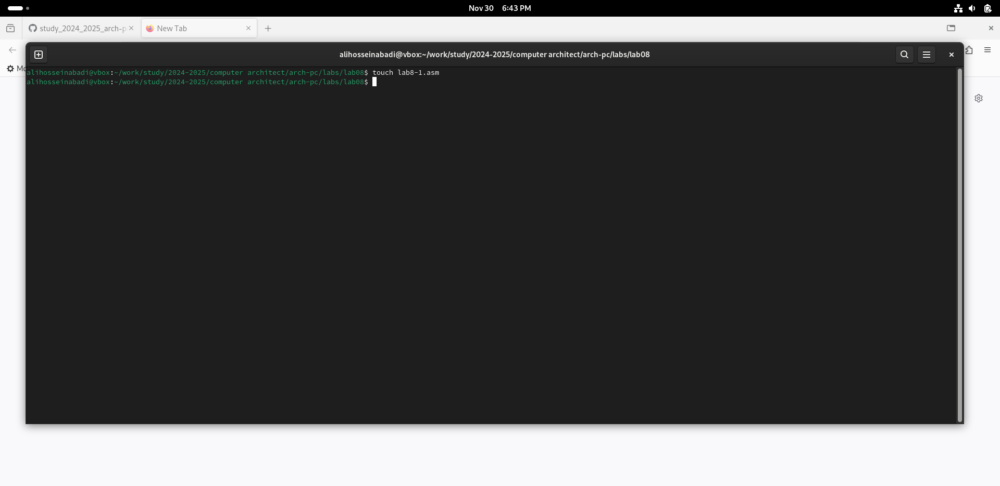
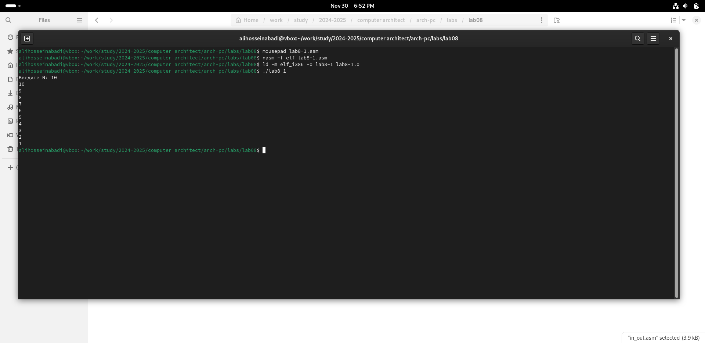
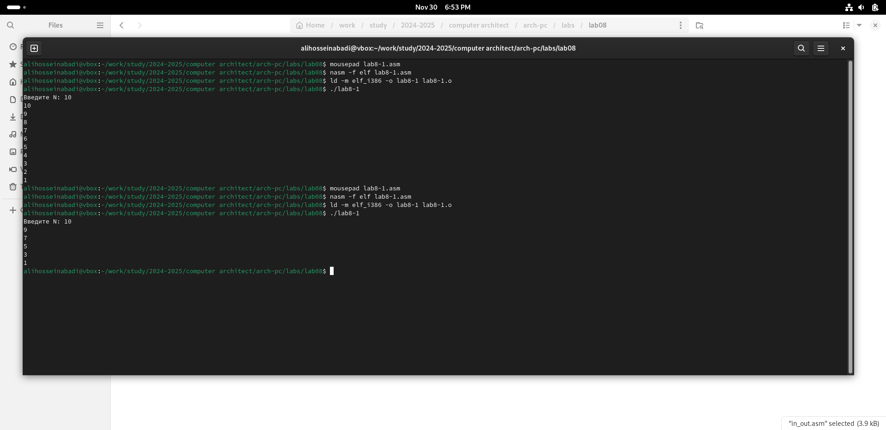
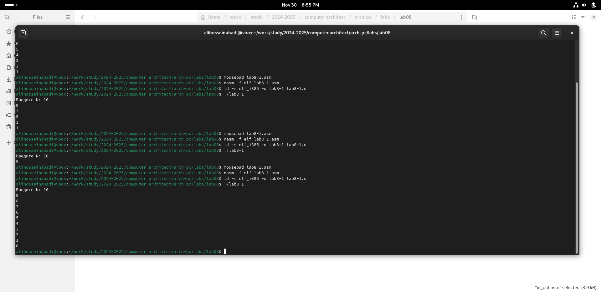
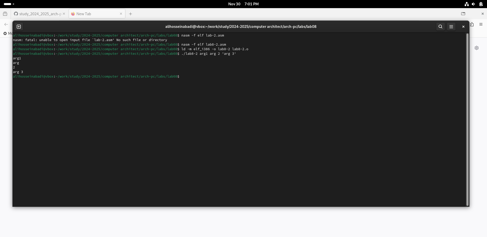
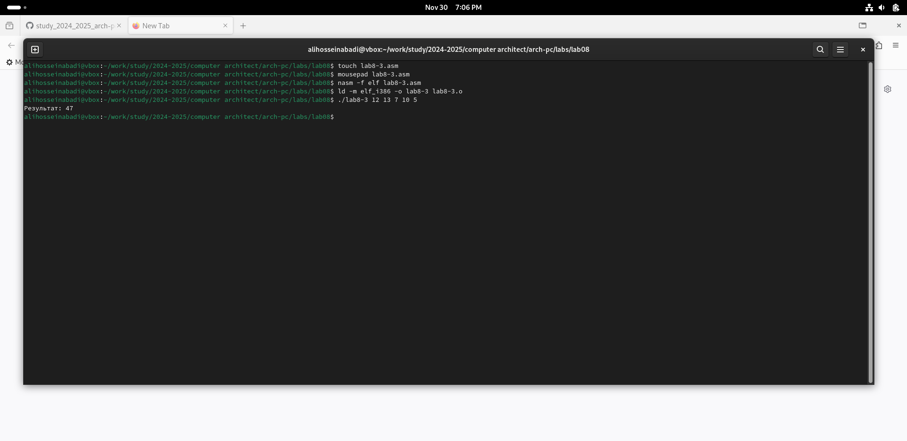
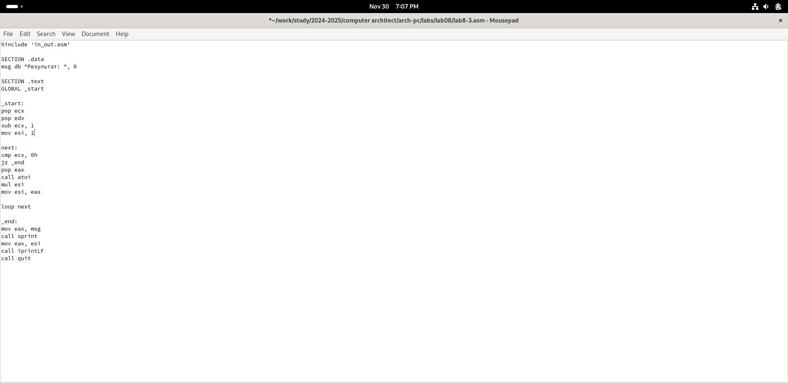
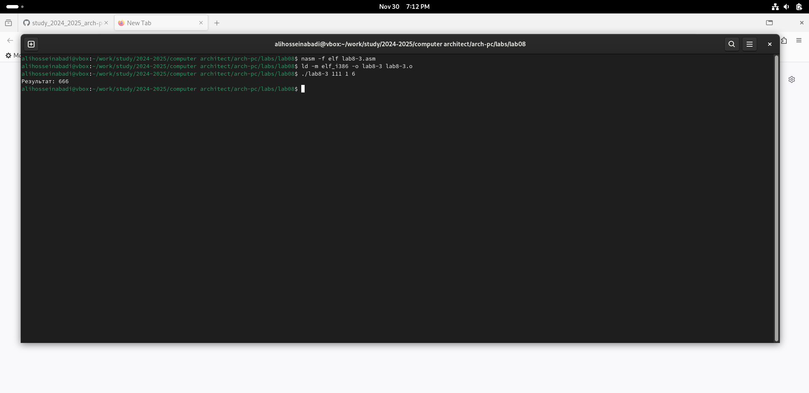
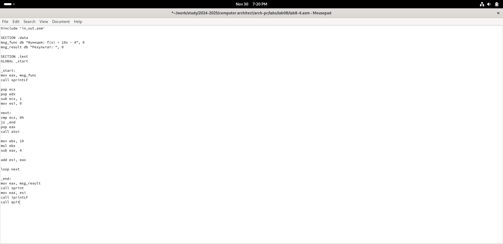
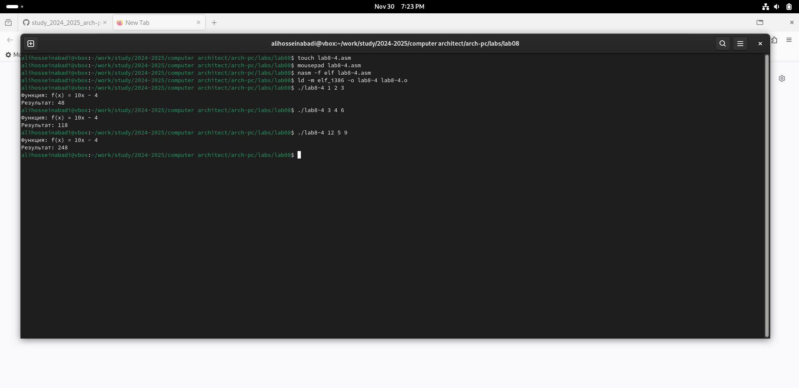

---
## Front matter
title: "answer to labrotary work 8"
subtitle: "Discipline: Computer Architecture"
author: "ali hosseinabadi"

## Generic otions
lang: ren-EN
toc-title: "Content"

## Bibliography
bibliography: bib/cite.bib
csl: pandoc/csl/gost-r-7-0-5-2008-numeric.csl

## Pdf output format
toc: true # Table of contents
toc-depth: 2
lof: true # List of figures
lot: true # List of tables
fontsize: 12pt
linestretch: 1.5
papersize: a4
documentclass: scrreprt
## I18n polyglossia
polyglossia-lang:
  name: russian
  options:
  - spelling=modern
  - babelshorthands=true
polyglossia-otherlangs:
  name: english
## I18n babel
babel-lang: russian
babel-otherlangs: english
## Fonts
mainfont: IBM Plex Serif
romanfont: IBM Plex Serif
sansfont: IBM Plex Sans
monofont: IBM Plex Mono
mathfont: STIX Two Math
mainfontoptions: Ligatures=Common,Ligatures=TeX,Scale=0.94
romanfontoptions: Ligatures=Common,Ligatures=TeX,Scale=0.94
sansfontoptions: Ligatures=Common,Ligatures=TeX,Scale=MatchLowercase,Scale=0.94
monofontoptions: Scale=MatchLowercase,Scale=0.94,FakeStretch=0.9
mathfontoptions:
## Biblatex
biblatex: true
biblio-style: "gost-numeric"
biblatexoptions:
  - parentracker=true
  - backend=biber
  - hyperref=auto
  - language=auto
  - autolang=other*
  - citestyle=gost-numeric
## Pandoc-crossref LaTeX customization
figureTitle: "Fig."
tableTitle: "Table"
listingTitle: "Listing"
lofTitle: "List of illustrations"
lotTitle: "List of Tables"
lolTitle: "Listings"
## Misc options
indent: true
header-includes:
  - \usepackage{indentfirst}
  - \usepackage{float} # keep figures where there are in the text
  - \floatplacement{figure}{H} # keep figures where there are in the text
---

# Goal of the Work

Acquiring skills in writing programs using loops and processing command-line arguments.

# Assignment

1. Loop implementation in NASM

2. Processing command-line arguments

3. Independent program writing based on the materials of the laboratory work

# Theoretical Introduction

A stack is a data structure organized according to the LIFO principle (“Last In — First Out”).  The stack is part of the processor architecture and is implemented at the hardware level. The processor has special registers (ss, bp, sp) and commands for working with the stack.

The main function of the stack is to save return addresses and pass arguments when calling procedures. In addition, memory is allocated in it for local variables, and register values can be temporarily stored.

# Performing the Laboratory Work

## Implementing Loops in NASM

I create a file for laboratory work No. 8 (Fig. -@fig:001).

{#fig:001 width=70%}

I copy the program from the listing into the created file (Fig. -@fig:002).

{#fig:002 width=70%}

I run the program; it shows the operation of loops in NASM (Fig. -@fig:003).

{#fig:003 width=70%}

I replace the original program so that in the loop body I change the value of the ecx register (Fig. -@fig:004).

{#fig:004 width=70%}

Due to the fact that now the ecx register decreases by 2 values on each iteration, the number of iterations is halved (Fig. -@fig:005).

{#fig:005 width=70%}

I add the push and pop commands to the program (Fig. -@fig:006).

{#fig:006 width=70%}

Now the number of iterations matches the entered N, but there was a shift in the output numbers by -1 (Fig. -@fig:007).

{#fig:007 width=70%}

## Processing Command-Line Arguments

I create a new file for the program and copy the code from the next listing into it (Fig. -@fig:008).

{#fig:008 width=70%}

I compile the program and run it, specifying the arguments. The program processed the same number of arguments as were entered (Fig. -@fig:009).

{#fig:009 width=70%}

I create a new file for the program and copy the code from the third listing into it (Fig. -@fig:010).
{#fig:010 width=70%}

I compile the program and run it, specifying some numbers as arguments; the program adds them (Fig. -@fig:011).

{#fig:011 width=70%}

I change the program's behavior so that it multiplies the specified arguments instead of adding them (Fig. -@fig:012).

{#fig:012 width=70%}

The program now actually multiplies the input numbers (Fig. -@fig:013).

{#fig:013 width=70%}

## Independent Work Assignment

I write a program that will find the sum of the values for the function f(x) = 5(2+x), which matches my ninth variant (Fig. -@fig:014).

{#fig:014 width=70%}

Program code:
```

%include 'in_out.asm'

SECTION .data
msg_func db "Функция: f(x) = 10x - 4", 0
msg_result db "Результат: ", 0

SECTION .text
GLOBAL _start

_start:
mov eax, msg_func
call sprintLF

pop ecx
pop edx
sub ecx, 1
mov esi, 0

next:
cmp ecx, 0h
jz _end
pop eax
call atoi

mov ebx, 10
mul ebx
sub eax, 4

add esi, eax

loop next

_end: 
mov eax, msg_result
call sprint
mov eax, esi
call iprintLF
call quit

,,,

I check the program's operation, specifying several numbers as arguments (Fig. -@fig:015).

{#fig:015 width=70%}

# Conclusions

As a result of this laboratory work, I acquired skills in writing programs using loops and also learned how to process command-line arguments.

# References

1. [Course on TUIS](https://esystem.rudn.ru/course/view.php?id=112)

2. [Laboratory Work No. 8](https://esystem.rudn.ru/pluginfile.php/2089095/mod_resource/content/0/%D0%9B%D0%B0%D0%B1%D0%BE%D1%80%D0%B0%D1%82%D0%BE%D1%80%D0%BD%D0%B0%D1%8F%20%D1%80%D0%B0%D0%B1%D0%BE%D1%82%D0%B0%20%E2%84%968.%20%D0%9F%D1%80%D0%BE%D0%B3%D1%80%D0%B0%D0%BC%D0%BC%D0%B8%D1%80%D0%BE%D0%B2%D0%B0%D0%BD%D0%B8%D0%B5%20%D1%86%D0%B8%D0%BA%D0%BB%D0%B0.%20%D0%9E%D0%B1%D1%80%D0%B0%D0%B1%D0%BE%D1%82%D0%BA%D0%B0%20%D0%B0%D1%80%D0%B3%D1%83%D0%BC%D0%B5%D0%BD%D1%82%D0%BE%D0%B2%20%D0%BA%D0%BE%D0%BC%D0%B0%D0%BD%D0%B4%D0%BD%D0%BE%D0%B9%20%D1%81%D1%82%D1%80%D0%BE%D0%BA%D0%B8.pdf)

3. [Programming in NASM Assembler Language, Stolyarov A. V.](https://esystem.rudn.ru/pluginfile.php/2088953/mod_resource/content/2/%D0%A1%D1%82%D0%BE%D0%BB%D1%8F%D1%80%D0%BE%D0%B2%20%D0%90.%20%D0%92.%20-%20%D0%9F%D1%80%D0%BE%D0%B3%D1%80%D0%B0%D0%BC%D0%BC%D0%B8%D1%80%D0%BE%D0%B2%D0%B0%D0%BD%D0%B8%D0%B5%20%D0%BD%D0%B0%20%D1%8F%D0%B7%D1%8B%D0%BA%D0%B5%20%D0%B0%D1%81%D1%81%D0%B5%D0%BC%D0%B1%D0%BB%D0%B5%D1%80%D0%B0%20NASM%20%D0%B4%D0%BB%D1%8F%20%D0%9E%D0%A1%20Unix.pdf)